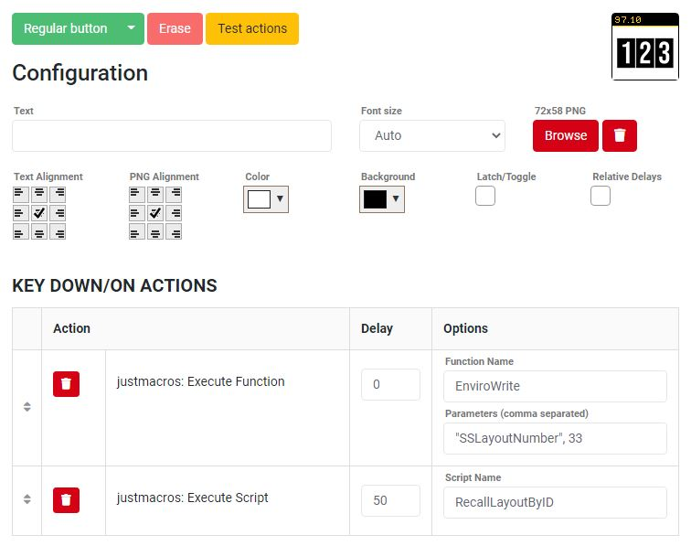

# companion-djp-supersource4
Companion config files for DJP's SuperSource4 transitions scripts with JustMacros for ATEM switchers

## Where can I get SuperSource4?
You can download the DJP SuperSource4 JustMacros scripts at https://djp.li/supersource4. If you haven't watched
DJP's YouTube video on these scripts, watch his video on [Animating SuperSource Transitions with ATEM Mini Extreme](https://youtu.be/oU5V6y5-6BI) on the [Doug Johnson Productions](https://www.youtube.com/channel/UCnsHD1yiKw-ERgDldZt_X2Q) YouTube 
channel.

You will also need:
- [Bitfocus Companion](https://bitfocus.io/companion/) (if you don't already have it)
- [JustMacros](https://justmacros.tv/)

## Where can I get the Companion configuration files?
You can download the latest version [here](https://github.com/estilles/companion-djp-supersource4/releases).

## What's in each Companion config file?
DJP grouped the SuperSource layouts using the categories in the table below.

Layout Numbers | Category
--- | ---
000-003 | 1-source (full-screen) layouts
004-025 | 2-source layouts
026-053 | 3-source layouts
054-063 | 4-source layouts
064-073 | No-Margin layouts
074-079 | Side by Side Layouts
080-085 | 3-Up Full Screen Layouts
086-096 | Zoom Layouts
097-105 | Layouts which utilize the background layer
106-108 | Layouts for DJP YouTube channel

---

Each Companion config file corresponds to each category above and contains the a single Stream Deck page, with one button per layout.

Every button has been configured with an thumbnail of the corresponding layout. Pressing a button will assign the `SSLayoutNumber` then it will `RecallLayoutByID`, effectively sending the layout to the ATEM's `Program`.

Here's a sample configuration for the button of layout number 33.

## Companion Pages
### 1-source (full-screen) layouts
Includes layouts 0 through 3.

%20layouts.png)

---

### 2-source layouts
Includes layouts 4 through 25.

---

### 3-source layouts
Includes layouts 26 through 53.

---

### 4-source layouts
Includes layouts 54 through 63.

---

### No-Margin layouts
Includes layouts 64 through 73.

---

### Side by Side Layouts
Includes layouts 74 through 79.

---

### 3-Up Full Screen Layouts
Includes layouts 80 through 85.

---

### Zoom Layouts
Includes layouts 86 through 96.

---

### Layouts which utilize the background layer
Includes layouts 97 through 105.

---

### Layouts for DJP YouTube channel
Includes layouts 106 through 108.

## Device compatibility
DJP's JustMacros scripts are only compatible to ATEM switchers that include the SuperSource multi-layer engine feature.

Device | SuperSource
--- | ---
ATEM Mini | No
ATEM Mini Pro | No
ATEM Mini Pro ISO | No
ATEM Mini Extreme | Yes
ATEM Mini Extreme ISO | Yes
ATEM Production Studio 4K | No
ATEM 1 M/E Production Studio 4K | No
ATEM 2 M/E Production Studio 4K | Yes
ATEM 4 M/E Broadcast Studio 4K | Yes

The above information is based on the features listed on the [Black Magic Design ATEM Product Page](https://www.blackmagicdesign.com/products/atem). I have only personally tested these on the ATEM Mini Extreme and Extreme ISO models.
